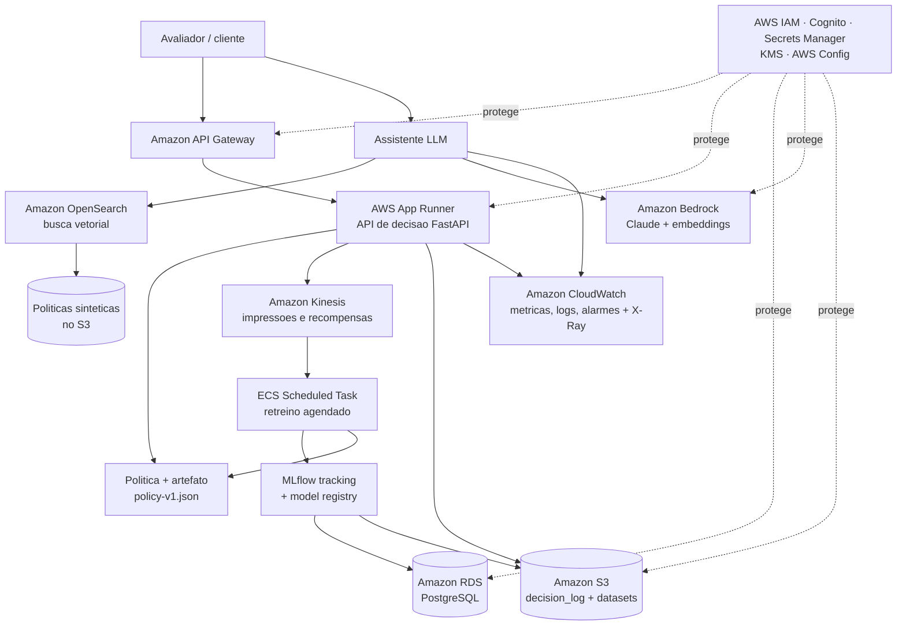

# Arquitetura-alvo AWS

Como a solução seria operada em produção, em **Amazon Web Services (AWS)**. Não há
recursos provisionados; este é o desenho-alvo, com plano de deploy
(`infra/aws/deployment-plan.md`) e justificativa de cada escolha.

Princípio de design: **a arquitetura mais simples que cobre todas as camadas**
(compute, API, dados/eventos, IA/RAG, observabilidade, segurança, identidade e
governança), priorizando serviços gerenciados e custo baixo ocioso.

## Diagrama (Mermaid)

## Mapeamento por camada

| Camada | Nosso componente | Serviço AWS | Por quê (mais simples) |
|---|---|---|---|
| Compute | API de decisão + jobs | **AWS App Runner** (+ ECR) | Roda nosso container FastAPI; autoscaling gerenciado; sem gerenciar Kubernetes |
| API/entrada | porta de entrada | **Amazon API Gateway** | Autenticação, rate limit e versionamento da API num só ponto |
| Dados | datasets, artefatos, logs | **Amazon S3** | Barato, durável; guarda Kaggle, processed, sintético, `policy-v*.json` e decision logs |
| Banco | tracking MLflow | **Amazon RDS for PostgreSQL** | Backend do MLflow; um banco gerenciado simples |
| Eventos | impressões e recompensas atrasadas | **Amazon Kinesis Data Streams** | Ingestão de eventos em fluxo; sustenta as delayed rewards |
| IA/LLM | assistente | **Amazon Bedrock** (Claude + embeddings) | **Claude roda nativo na AWS** — mesmo modelo do dev, sem troca |
| Busca | recuperação de políticas | **Amazon OpenSearch** (k-NN/vetorial) | Index dos documentos sintéticos para o RAG |
| MLOps | retreino e versionamento | **ECS Scheduled Task + MLflow** | Job agendado/event-driven; MLflow registry para promover/reverter políticas |
| Observabilidade | métricas, logs, traces | **Amazon CloudWatch + X-Ray** | Latência, recompensa, drift, custo, uso do assistente |
| Identidade | quem acessa o quê | **AWS IAM (roles) + Amazon Cognito** | Serviços se autenticam por role (sem senha); usuários via Cognito |
| Segredos | chaves e conexões | **AWS Secrets Manager + KMS** | Nenhum segredo no código ou na imagem; criptografia por KMS |
| Governança | políticas da nuvem | **AWS Config + SCPs** | Impõe regras (recursos permitidos, tags, criptografia) |

## Identidade e gestão de segredos

Regra: **nenhum segredo no código nem na imagem**. Tudo no Secrets Manager,
acessado por **IAM Role** (o serviço assume uma role e pega os segredos sem
usuário/senha).

| Segredo | Onde fica | Quem acessa |
|---|---|---|
| String de conexão do RDS | Secrets Manager | App Runner (IAM Role) |
| Acesso ao Amazon Bedrock | IAM Role (sem chave) | API e assistente |
| Chave do provedor LLM de dev (Anthropic) | Secrets Manager | só ambiente de dev |
| Acesso ao S3 | IAM Role | API e jobs (sem chave) |

O `.env.example` do repositório lista exatamente as variáveis que, em produção,
viram **secrets no Secrets Manager** (mapeamento 1:1). IAM dá a cada serviço só o
acesso de que precisa (least privilege).

## Observabilidade

- **CloudWatch (métricas + logs):** latência e disponibilidade da API, erros, e
  consultas sobre os decision logs.
- **AWS X-Ray:** tracing distribuído entre componentes.
- **CloudWatch Alarms:** dispara em drift de recompensa, latência alta ou custo
  acima do esperado.
- Métricas de negócio: conversão, regret, exploração, fairness de exposição e uso
  do assistente.

## Governança

- **AWS Config + Service Control Policies:** só serviços/regions permitidos,
  criptografia obrigatória, tags de custo.
- **Humano no loop:** promoção de política exige aprovação (ver Etapa 7).
- **LGPD:** dados sintéticos, sem PII real; logs sem dado sensível (ver Etapa 8).

## Trade-offs (alternativas descartadas)

| Decisão | Escolhido | Descartado | Motivo |
|---|---|---|---|
| Compute | App Runner | **EKS (Kubernetes)** | EKS é poderoso mas complexo e caro ocioso; não precisamos desse controle |
| Compute | App Runner | **AWS Lambda** | Nosso serviço é um container completo; Lambda encaixa mal o FastAPI + estado |
| MLflow | self-hosted + RDS | **SageMaker** (MLflow gerenciado) | SageMaker é mais completo, porém mais pesado/caro para o escopo |
| Banco | RDS PostgreSQL | **DynamoDB** | DynamoDB é NoSQL; MLflow espera SQL relacional |
| LLM | Amazon Bedrock (Claude) | provedor fora da AWS | Bedrock hospeda o **mesmo Claude** do dev — sem troca de modelo |

## Escala e redução (maleabilidade)

| Volume | Comportamento |
|---|---|
| Baixa carga | App Runner reduz instâncias ao mínimo; Kinesis em 1 shard |
| Alta carga | App Runner adiciona instâncias automaticamente; Kinesis adiciona shards; OpenSearch ganha réplicas |
| Ajuste manual | Tier do RDS e nº de shards/réplicas (não escalam totalmente sozinhos) |
| Custo mesmo ocioso | RDS e OpenSearch cobram parados; App Runner e S3 quase não |

## Custo qualitativo (FinOps inicial)

| Serviço | Custo ocioso | Custo sob carga | Observação |
|---|---|---|---|
| App Runner | baixo | baixo-médio | paga por instância ativa/requisição |
| S3 | muito baixo | baixo | barato por GB |
| RDS PostgreSQL | baixo fixo | baixo | cobra mesmo parado (instância mínima) |
| Kinesis | baixo | médio | por shard-hora |
| Amazon OpenSearch | médio fixo | médio | **cobra mesmo ocioso** (instância mínima) |
| Amazon Bedrock | zero | variável | paga por token (chamadas do assistente) |
| API Gateway | baixo | médio | por requisição |
| CloudWatch | baixo | por GB ingerido | controlar volume de logs |

**ROI (raciocínio):** o ganho da política adaptativa sobre uma campanha estática
(mais conversão, menos tráfego desperdiçado) deve superar o custo incremental dos
serviços que cobram ociosos (principalmente OpenSearch e RDS). O detalhamento de ROI
e TCO entra no vídeo/pitch (Etapa 8).
